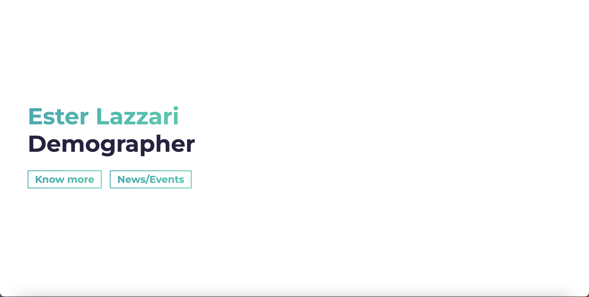

# Ester Lazzari Website Instructions 

## Getting Started 🚀

These instructions will get you a copy of the project up and running on your local machine for development and testing purposes. See deployment for notes on how to deploy the project on a live system.

### Prerequisites 📋

You'll need [Git](https://git-scm.com) and [Node.js](https://nodejs.org/en/download/) (which comes with [NPM](http://npmjs.com)) installed on your computer.

```
node@v16.4.2 or higher
npm@7.18.1 or higher
git@2.30.1 or higher
```

---

## How To Use 🔧


Using NPM: Simply run the below commands.

```bash
# Install dependencies
$ npm install

# Start the development server
$ npm start
```

**NOTE**:
If your run into issues installing the dependencies with NPM, use this below command:

```bash
# Install dependencies with all permissions
$ sudo npm install --unsafe-perm=true --allow-root
```

Once your server has started, go to this url `http://localhost:1234/` to see the portfolio locally. It should look like the below screenshot.

<h2 align="center">
  
</h2>

---


### (3) Projects Section

- Each project lives inside a `row`.
- On `<h3>` tag with class name `.project-wrapper__text-title`, include your project title.
- On `<p>` tag with `loremp ipsum` text, include your project description.
- On first `<a>` tag, put your project url on `href` property.
- On second `<a>` tag, put your project repository url on `href` property.

---

- Inside `<div>` tag with class name `.project-wrapper__image`, put your project image url on the `src` of the `` and put again your project url in the `href` property of the `<a>` tag.
- Recommended size for project image (1366 x 767), your project image must be located inside `/src/assets/` folder.

```html
<!-- **** Projects Section **** -->
<section id="projects">
  ...
  <!-- Notice: each .row is a project -->
  <div class="row">
    <div class="col-lg-4 col-sm-12">
      <div class="project-wrapper__text load-hidden">
        <h3 class="project-wrapper__text-title">Project Title</h3>
        <div>
          <p class="mb-4">
            Lorem ipsum dolor sit, amet consectetur adipisicing elit. Excepturi
            neque, ipsa animi maiores repellendus distinctio aperiam earum dolor
            voluptatum consequatur blanditiis inventore debitis fuga numquam
            voluptate ex architecto itaque molestiae.
          </p>
        </div>
        <a
          rel="noreferrer"
          target="_blank"
          class="cta-btn cta-btn--hero"
          href="#!"
        >
          See Live
        </a>
        <a
          rel="noreferrer"
          target="_blank"
          class="cta-btn text-color-main"
          href="#!"
        >
          Source Code
        </a>
      </div>
    </div>
    <div class="col-lg-8 col-sm-12">
      <div class="project-wrapper__image load-hidden">
        <a rel="noreferrer" href="#!" target="_blank">
          <div
            data-tilt
            data-tilt-max="4"
            data-tilt-glare="true"
            data-tilt-max-glare="0.5"
            class="thumbnail rounded js-tilt"
          >
            
          </div>
        </a>
      </div>
    </div>
  </div>
  <!-- /END Project -->
  ...
</section>
```


### Step 2 - STYLES

Change the color theme of the website - (choose 2 colors to create a gradient)

Go to `/src/sass/abstracts/_variables.scss` and only change the values for this variables `$main-color` and `$secondary-color` with your prefered HEX color.
If you want to get some gradients inspiration I highly recommend you to check this website [UI Gradient](https://uigradients.com/#BrightVault)

```scss
// Default values
$main-color: #02aab0;
$secondary-color: #00cdac;
```

---

## Deployment 📦

Deployment is dealt with using [Netlify](https://netlify.com) because it is super easy.

## Technologies used 🛠️

- [Parcel](https://parceljs.org/) - Bundler
- [Bootstrap 4](https://getbootstrap.com/docs/4.3/getting-started/introduction/) - Frontend component library
- [Sass](https://sass-lang.com/documentation) - CSS extension language
- [ScrollReveal.js](https://scrollrevealjs.org/) - JavaScript library
- [Tilt.js](https://gijsroge.github.io/tilt.js/) - JavaScript tiny parallax library

## Authors

- **Daniel Li** - [https://github.com/danielliaus](https://github.com/danielliaus)


## Status

[](https://app.netlify.com/sites/tourmaline-buttercream-0f3878/deploys)

## License 📄

This project is licensed under the MIT License - see the [LICENSE.md](LICENSE.md) file for details

## Acknowledgments 🎁

I used the simplefolio template developed by - **Jacobo Martinez** - [https://github.com/cobidev](https://github.com/cobidev). 
